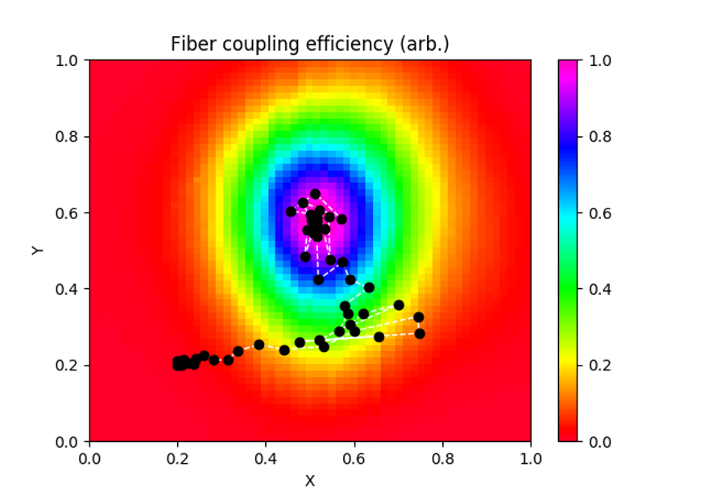

##############
Optimization
##############

What is an experiment? This question has many answers, but across many fields
an experiment can be described as:

#. Preparation of an initial sample

#. Performing a sequence of actions on the sample

#. Measuring the result

In atomic physics, theorists love to track the state of an atomic system while
applying a series of unitaries; on the experimental side, it is useful instead
to track the state of the devices performing these actions. We suggest that any
experiment can be formally modeled through a functional

.. math:: \mathcal M(T) = \mathcal F[X(t<T)]

In words: the measurement result at time :math:`T` is a function of the state vector :math:`X` at
all times leading up to the measurement. The state vector is a representation
of the individual states of all devices involved in the experiment. We are often
concerned with determining the state vector :math:`X(t)` which minimizes or maximizes
:math:`\mathcal M(T)`.

Steady-state optimization
===========================
To make this formalism more intuitive, let's first study an experiment with a
memoryless cost functional :math:`\mathcal F[X(T)]]``, where the measurement depends on the input
state at time :math:`T` but not the history. Let's see how EMERGENT describes this process.

State representation
---------------------
Each physical degree of freedom is represented by an :doc:`/architecture/input` node; in this case, there are two nodes labeled ``X`` and ``Y`` which
represent the tip and tilt of the mirror. The ``Input.state`` attribute stores a
float representing the instantaneous state of the input. Input nodes are attached
to :doc:`/architecture/device` nodes which represent the physical actuator, such as the voltage control
board for the MEMS. The Device node stores the state of all of its attached inputs
in a dict of the form ``Device.state = {'X'-60, 'Y':1}``. Note that the keys of
the dict correspond to whatever the ``Input.name`` variable is. State changes
are initiated by :doc:`/architecture/control` nodes, which interface with one or many devices to
control the macroscopic state of the experiment. The Control node stores the
state similarly to the Device node, but with an additional tag in each dict key
corresponding to each device's ``name`` parameter; for example, ``Control.state =  {'MEMS.X'-60, 'MEMS.Y':1}``.
To change the state, call ``Control.actuate(state)``, where the argument is a
dictionary containing one or more inputs to update. The ``actuate`` method will
separate the state of the Control node into separate substates for each linked
Device node, then call each ``Device.actuate(substate)`` method to produce the
physical change. More explicitly, the physical change is carried out by
``Device._actuate(substate)``, which is a special method called by ``Device.actuate(substate)``
which should be separately implemented for each device driver according to the
manufacturer's control scheme. Afterwards, the ``Device.update(state)`` simultaneously updates
the internal state representations of the Input, Device, and Control nodes to
keep the network synchronized.

As well as distributing user-initiated commands, the :doc:`/architecture/control`
node oversees the entire experiment by issuing commands to the inputs
during optimization algorithms. It contains methods, tagged with the @cost decorator,
which prepare and evaluate a target state, and closed-loop operation between the
Control node and an attached Optimizer module can quickly determine the correct
input states to minimize a given cost function.

Optimization
-------------
To make the connection clear between the code and the formalism, here is the
typical optimization sequence:

1. The initial state :math:`X` is represented through a dict ``state``, and is passed into the :doc:`/archetypes/optimizer` module along with a cost function ``cost``.
2. The cost function :math:`\mathcal F[X]` is evaluated by calling ``cost(state)``.

	a. ``Control.actuate(state)`` distributes commands to linked Device nodes.
	b. The Device node runs ``Device._actuate(state)`` to update the physical state.
	c. The Device node updates the internal state representation of the Input, Device, and Control nodes.
	d. A physical measurement of :math:`\mathcal F[X]` is made.
3. The learner updates its knowledge of the cost landscape :math:`\mathcal F[X]`, suggests a new state :math:`X`, and returns to step 2.

Note that in the code we often use ``state`` to refer to a dictionary (or a single
value in the case of an Input node), whereas the variable ``X`` refers to an
array representation of the dictionary.

Example: fiber alignment
-------------------------
An example which is ubiquitous in AMO
physics is the fiber coupling problem, in which we want to steer a laser beam
into an optical fiber to maximize the light transmitted on the other end. This
is typically done by controlling the tip and tilt of two mirrors, where the more
distant mirror is used to translate the beam relative to the fiber tip while the
closer is used to adjust the angle. If only one mirror is adjusted, the measurement
will look like the Gaussian overlap of the beam and the fiber mode, and simple
hill-climbing algorithms can be employed to find the tip/tilt pair :math:`(x,y)` which
maximizes the measurement :math:`M`. This is an example of a convex optimization problem,
where the local minimum is also the global minimum.

And the results: the graphs below show a real fiber alignment routine run by EMERGENT. The left
graph plots the simplex trajectory over the independently measured cost landscape,
while the right graph shows a time series of the optimization, demonstrating
convergence in several seconds.

.. image:: simplex_time_series.png
    :width: 49 %

Time-dependent optimization
==============================
Turning now to a more complicated time-dependent cost functional, we consider
the problem of magneto-optical trapping, in which atoms are trapped at the zero
of a quadrupole magnetic field in a red-detuned laser beam. The problem can be
formulated as a memoryless cost functional depending on parameters such as the
field strength and laser detuning, but the trapping can be improved by adding a
time-dependent ramp such that the Doppler and Zeeman shifts keep the beam resonant
while the atoms cool. In this case we are tasked with determining not the
steady-state parameter values but instead the ramp shape which maximizes the
number of trapped atoms. Algorithmic optimization of atom cooling has been
achieved through parameterized ramps, where each of the :math:`d` inputs :math:`x(t)` is stepped
discretely through :math:`N` steps :math:`(t_1,...,t_N)`; the :math:`N` setpoints of each parameter are used
as inputs into a regressor which interpolates the :math:`Nd`-dimensional cost landscape
to search for a minimum. Unlike the simple fiber coupling example, these problems
possess very complex, high-dimensional cost landscapes which may have many local
minima as well as high shot-to-shot noise, so deterministic convex solvers such
as gradient descent algorithms are unlikely to find the global minimum. A solution
is to use stochastic optimization algorithms, such as differential evolution or
stochastic artificial neural networks. Here the objective is to model rather than
simply explore the cost landscape, and to use information gained in each cycle
to improve the determination of the global maximum.

Sequence representation
------------------------
Let's look at how EMERGENT handles sequences. For example, let's
consider a Control node called ``MOT`` with a Device node ``laser`` and and
an Input node ``frequency``. We define a sequence of an Input node as a list of
tuples, where each tuple represents a point in the sequence; its first element
is the time, while its second element is the state at that time. Let's define a
four-step ramp over a 1 second experimental cycle:

.. code-block:: python

	 MOT.inputs['laser.frequency']=[(0,-42),(0.25,-35), (0.5, -28), (0.75, -21)]

Now let's add a new Device ``coils`` with an Input ``gradient``, which will
be ramped in a two-step sequence:

.. code-block:: python

	 MOT.inputs['coils.gradient']=[(0,50),(0.5, 25)]

Sequencing is handled by the :doc:`/archetypes/clock` module. The ``Clock.prepare_sequence()`` method
inspects the sequences of the individual inputs, then prepares a master sequence
composed of the total experimental state at all timesteps:

.. code-block:: python

	 MOT.clock.prepare_sequence()
	 MOT.sequence

.. code-block:: python

	 [(0.25, {'laser.frequency': -42, 'coils.gradient': 50}),
	  (0.25, {'laser.frequency': -35, 'coils.gradient': 50}),
	  (0.25, {'laser.frequency': -28, 'coils.gradient': 25}),
	  (0.25, {'laser.frequency': -21, 'coils.gradient': 25})]

The sequence can be run for a single shot with ``Control.clock.run_once()`` or
looped with ``Control.clock.start()``. For each tuple in the sequence, the state
dict is passed into the ``Control.actuate()`` method; afterwards, there is a delay
given by the first element of each tuple before the next actuation.

Example: ramped loading
------------------------
For an example of a time dependent optimization problem, consider the 1D functional

.. math:: \mathcal M(T) = \int_0^T \frac{1}{1+(1-xt)^2}dt,

which qualitatively reproduces the required behavior to
optimize a MOT - the functional is maximized for the ramp :math:`x=1/t`. If we were naive
to the form of the cost function, we could algorithmically maximize the function.
We discretize the inputs as :math:`x_i=x(t_i)` and compute the cost function as

.. math:: \mathcal M(T) = \frac{T}{N}\sum_{i=1}^N \frac{1}{1+(1-x_it_i)^2},

where :math:`T=1`. This function is implemented in the ``emergent/examples/basic``
network as ``control.cost_ramp``, which takes a sequence as an argument. This
example can be run with the ``TestControl.optimize_sequence()`` function.

We'll initialize the state with a guess :math:`x_i=1` for all :math:`i` and run a
simplex algorithm to optimize the inputs. Note that EMERGENT's algorithms can
handle states or sequences interchangeably - if you pass in a state like
``state={'X':1, 'Y':2}``, it decomposes it to array form ``[1,2]`` before
optimization, whereas a sequence like ``{'X':[(0,0),(0.5,1)], 'Y':[(0,2), (0.5,3)]}``
is represented in array form as ``[0,1,2,3]``. After this, the algorithm doesn't
care if it's working with a state or sequence - it simply passes this array into
a cost function which actuates a state or runs a sequence and returns a result.

Subspace decoupling
====================
The sophisticated algorithms contained in the EMERGENT library can optimize cost
functions of many degrees of freedom, but most powerful of all is the ability to
avoid this through subspace identification and dimensional reduction. By using
principal component analysis, EMERGENT will be able to project the cost landscape
onto a set of orthogonal virtual inputs, hence decomposing a high-dimensional
coupled optimization problem into many lower-dimensional problems. To see the
power of this, consider a grid search algorithm which searches for an optimum
point with :math:`N` uniformly sampled points for each of :math:`d` devices. The
number of iterations required, :math:`N^d`, is entirely infeasible for even modest
numbers of devices - for example, just a coarse 10-step sampling with 10 connected
inputs would take 317 years with an experimental cycle of 1 Hz! However, by
diagonalizing the covariance matrix, the problem can be reduced into 10 1D
optimizations which can be performed independently, requiring only :math:`Nd` steps!
In doing so, we replace the physical inputs with virtual inputs, which are linear
combinations of the original ones.

For example, consider a cost landscape consisting of a stretched two-variable
Gaussian which is rotated by 30 degrees about the :math:`z` axis. The effects of
the coupling are evident: performing a line search in :math:`x` or :math:`y`
alone will not in general find the maximum, since by changing one variable we
change the optimal position of the other. However, we can efficiently solve the
problem by rotating our inputs into a frame where they are decoupled. Then, we
can solve two separate 1D optimization problems in terms of the rotated inputs.
